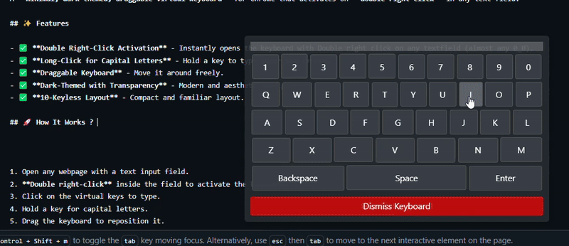

# 🖥️ Lazy Keyboard - Chrome Extension

A **minimal, dark-themed, draggable virtual keyboard** for Chrome that activates on **double right-click** in any text field.

## ✨ Features

- ✅ **Double Right-Click Activation** - Instantly opens the keyboard with Double right click on any textfield (almost any 0_0).
- ✅ **Long-Click for Capital Letters** - Hold a key to type uppercase letters.
- ✅ **Draggable Keyboard** - Move it around freely. 
- ✅ **Dark-Themed with Transparency** - Modern and aesthetic design.
- ✅ **10-Keyless Layout** - Compact and familiar layout.
  
## 🚀 How It Works ? It does not          

## 🎥 Demo  


1. Open any webpage with a text input field.
2. **Double right-click** inside the field to activate the keyboard.
3. Click on the virtual keys to type.
4. Hold a key for capital letters.
5. Drag the keyboard to reposition it.

## 🛠️ Installation Guide

### Clone the Repository

```sh
git clone https://github.com/Aihrarshaikh/Lazy-Keyboard.git
cd Lazy-Keyboard
```

### Load the Extension in Chrome

1. Open **Google Chrome** and go to `chrome://extensions/`.
2. Enable **Developer Mode** (toggle in the top right corner).
3. Click **Load unpacked**.
4. Select the **Lazy-Keyboard** folder.
5. The extension is now added to Chrome! 🎉

## 📝 Testing the Extension

* Open any webpage with a text field (e.g., Google Search, Twitter, YouTube).
* **Double right-click** inside the text box.
* The keyboard should appear and function as expected.

## ❓ Troubleshooting

* Ensure the extension is **enabled** in `chrome://extensions/`.
* Open Chrome DevTools (`F12` → Console) to check for errors.
* Make sure you have the **latest version** of Chrome installed.

## 🤝 Contributing

Contributions are welcome! Fork the repository, make improvements, and submit a **pull request**.

## 📜 License

This project is licensed under the **MIT License**.
